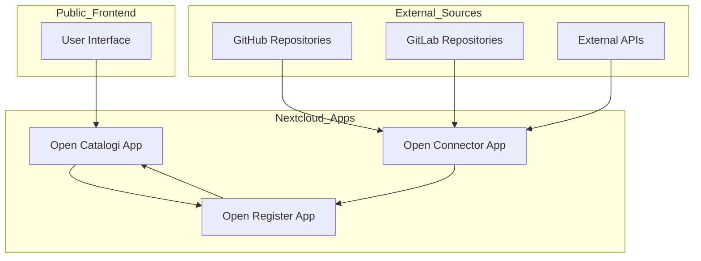
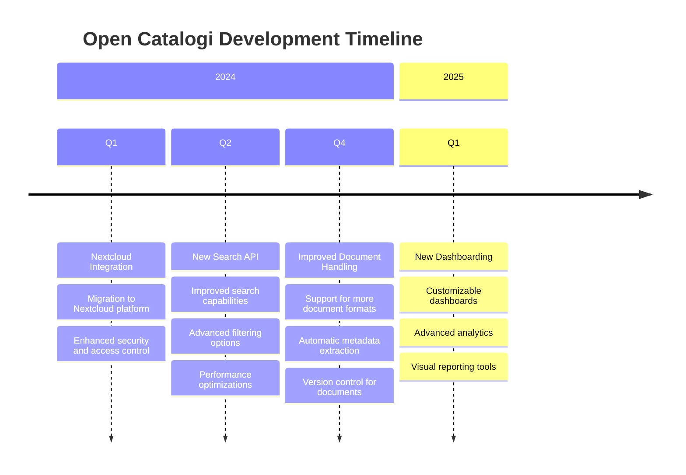

# Open Catalogi

## What is Open Catalogi?

Open Catalogi is an open source solution designed to help government organizations create, manage, and share catalogs of their software, services, and data. It enables transparent publication of public sector information, making it easier for citizens, businesses, and other government entities to discover and utilize available resources.

The platform follows open standards and principles, supporting the goals of digital transparency, interoperability, and reusability in government. Open Catalogi helps organizations comply with regulations like the Public Access to Government Information Act (WOO) while providing a user-friendly interface for both publishers and consumers of information.

## System Architecture

Open Catalogi consists of several integrated components that work together to provide a complete catalog management solution:



### Component Descriptions

1. **Public Frontend**
   - **User Interface**: The web interface that users interact with to browse and search catalogs

2. **Nextcloud Apps**
   - **Open Catalogi App**: Manages the presentation and organization of catalog items
   - **Open Register App**: Core data storage and management system for catalog items
   - **Open Connector App**: Integrates with external data sources to import catalog items

3. **External Sources**
   - **GitHub/GitLab Repositories**: Source code repositories that can be indexed
   - **External APIs**: Other data sources that can be connected to enrich the catalog

## Manuals

Open Catalogi provides manuals for three different target groups:

### Developers
Manuals for developers who want to further develop Open Catalogi. This documentation contains technical information about the architecture, APIs, and how to contribute to the codebase.

### (Functional) Administrators 
Manuals for administrators who want to configure and set up Open Catalogi. This documentation contains information about managing catalogs, metadata, organizations and directories.

### Users
Manuals for end users who use Open Catalogi daily for example:
- 📝 Publishing WOO requests
- 📋 Making permits available for inspection  
- 🗂️ Managing a complete catalog for software for example

## Key Features

- 📚 **Component Catalog**: Create and maintain a comprehensive catalog of software components, APIs, and services
- 📄 **PublicCode.yml Support**: Automatic extraction and validation of PublicCode.yml metadata from repositories
- 🏢 **Organization Profiles**: Showcase organizations and their digital offerings in a standardized format
- 🔄 **GitHub/GitLab Integration**: Automatically index and catalog repositories from GitHub and GitLab organizations
- ☁️ **Nextcloud Integration**: Seamless integration with Nextcloud for secure storage and access control
- 🌐 **Open Standards**: Built on open standards like PublicCode.yml, EUPL, and Common Ground principles
- ✅ **Compliance Support**: Help organizations comply with transparency requirements (WOO) and reuse policies
- 🔗 **Component Relationships**: Visualize dependencies and relationships between components
- 🌍 **Multilingual Support**: Interface and content available in multiple languages
- 📱 **Responsive Design**: User-friendly interface that works on desktop and mobile devices
- 🔍 **Faceted Search**: Advanced search capabilities with filtering by various metadata fields
- 🔌 **API Access**: RESTful API for programmatic access to catalog data

## Benefits of Open Catalogi

### For Government Organizations
- 🏛️ **Transparency**: Easily publish information about your digital services and software
- 💰 **Cost Efficiency**: Reduce duplication by discovering existing solutions
- 🤝 **Collaboration**: Find partners working on similar challenges
- 📊 **Oversight**: Maintain a clear overview of your digital portfolio
- ⚖️ **Compliance**: Meet legal requirements for transparency and reuse

### For Citizens and Businesses
- 🔎 **Discoverability**: Find government services and information more easily
- 📱 **Accessibility**: Access government resources through a user-friendly interface
- 🧩 **Integration**: Build upon existing government components for new solutions
- 📈 **Innovation**: Identify opportunities for improvement and innovation

### For Developers
- 🧰 **Reusable Components**: Find and reuse existing government software components
- 📚 **Documentation**: Access comprehensive documentation for government APIs and services
- 🔧 **Contribution**: Easily contribute improvements to government software
- 🌱 **Open Source**: Benefit from and participate in open source government projects

## Project History

Open Catalogi has evolved significantly since its inception, with continuous improvements and new features being added to better serve the needs of government organizations, citizens, and developers.



### Key Milestones

#### Q1 2024: Nextcloud Integration
The integration with Nextcloud marked a significant advancement for Open Catalogi, providing a robust foundation for secure storage, access control, and collaboration features. This migration enhanced the platform's security posture and enabled seamless integration with existing Nextcloud deployments in government organizations.

#### Q2 2024: New Search API
The introduction of a new Search API dramatically improved the discoverability of catalog items. With enhanced search capabilities, advanced filtering options, and significant performance optimizations, users can now find relevant resources more quickly and accurately.

#### Q4 2024: Improved Document Handling
Document handling capabilities were substantially enhanced with support for additional formats, automatic metadata extraction, and version control. These improvements streamlined the process of publishing and managing documents within catalogs.

#### Q1 2025: New Dashboarding (Planned)
The upcoming dashboarding features will provide users with customizable views, advanced analytics, and visual reporting tools. These enhancements will enable better insights into catalog usage and content, supporting data-driven decision making.

## Getting Started

Ready to start using Open Catalogi? Follow these steps to get up and running quickly:

### For Organizations

1. **Installation**: 
   - Set up Nextcloud on your server
   - Install the Open Catalogi, Open Register, and Open Connector apps
   - Configure your organization profile

2. **Connect Your Repositories**:
   - Link your GitHub or GitLab organization
   - Configure webhooks for automatic updates
   - Set up metadata extraction rules

3. **Customize Your Catalog**:
   - Define your catalog structure
   - Set up access permissions
   - Configure branding and appearance

### For Developers

1. **Local Development Environment**:
   - Clone the repositories:
     ```bash
     git clone https://github.com/OpenCatalogi/opencatalogi-app.git
     git clone https://github.com/OpenCatalogi/openregister-app.git
     git clone https://github.com/OpenCatalogi/openconnector-app.git
     ```
   - Set up Nextcloud development environment
   - Install dependencies and build the apps

2. **API Integration**:
   - Review the API documentation
   - Generate API keys
   - Test your integration

For detailed instructions, see the [Installation Guide](/docs/Installation) and [Developer Guide](/docs/Developers).
