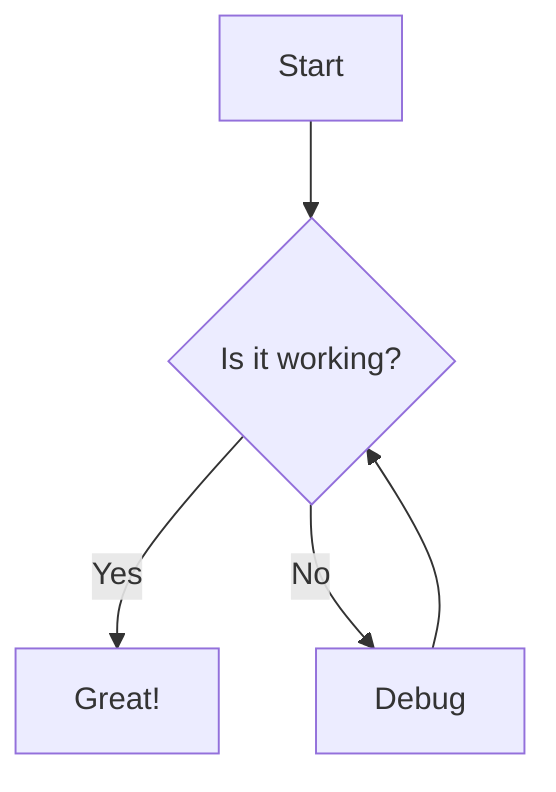
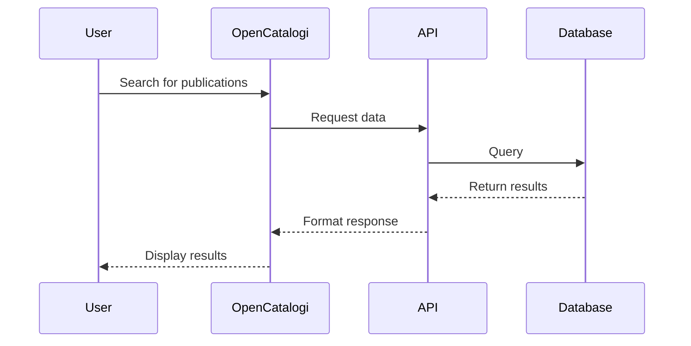
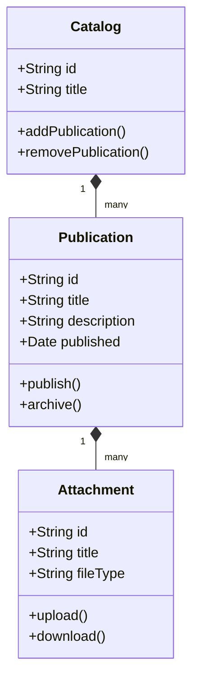
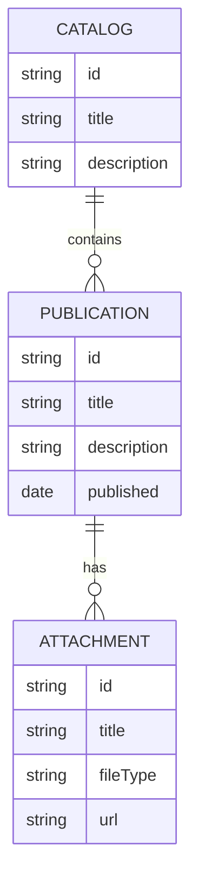
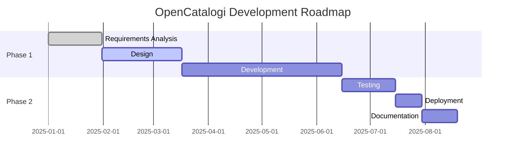
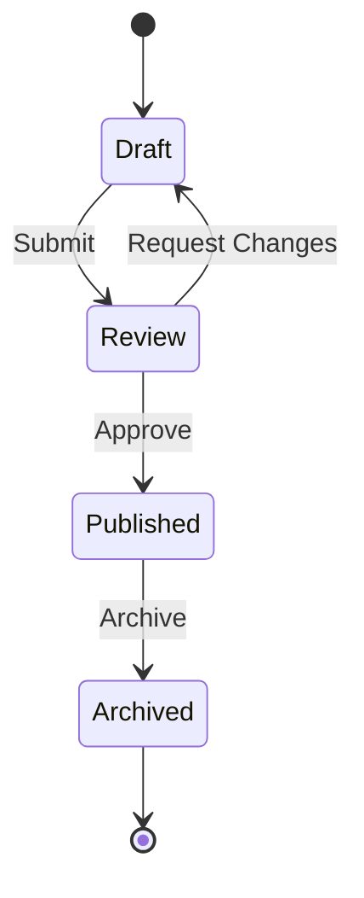

# Mermaid Diagram Examples

This page demonstrates how to use Mermaid diagrams in the documentation.

## Flowchart Example

## Sequence Diagram Example

## Class Diagram Example

## Entity Relationship Diagram

## Gantt Chart Example

## State Diagram Example

## Using Mermaid in Documentation

To add a Mermaid diagram to your documentation:

1. Create a code block with the `mermaid` language identifier
2. Write your Mermaid diagram syntax inside the code block
3. The diagram will be rendered automatically when the page is displayed

For more information on Mermaid syntax, visit the [Mermaid documentation](https://mermaid.js.org/intro/). 